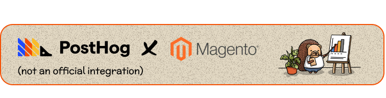

<span align="center">
  
</span>

# PostHog Analytics for Magento 2

Magento 2 module that integrates [PostHog](https://posthog.com) product analytics with **cookieless mode**, a **consent extension point**, and **pre-configured ecommerce events** aligned with [PostHog’s ecommerce spec](https://posthog.com/docs/data/event-spec/ecommerce-events).

## Features

- **PostHog script loading** — Configurable API host and project key (store-scoped; multi-site capable).
- **Cookieless by default** — `cookieless_mode` defaults to `always` (no cookies/localStorage). Optional: `on_reject` (cookieless until consent, then cookies) or `off` (full cookies).
- **Consent extension point** — Plug in any consent banner (e.g. Amasty GDPR, OneTrust, or custom) via a JS contract and layout container; no built-in banner.
- **Ecommerce events** — Products Searched, Product List Viewed, Product Viewed, Product Added, Product Removed, Cart Viewed, Checkout Started, Order Completed.
- **CSP** — Whitelist included for `*.posthog.com` (or your proxy domain).

## Requirements

- Magento 2.4.X (tested on 2.4.6; may work on earlier version with minimal changes).
- PHP 8.1+.

## Installation

```bash
# Enable the module
bin/magento module:enable Indexa_Posthog

# Run setup
bin/magento setup:upgrade

# Compile and deploy static content (if needed)
bin/magento setup:di:compile
bin/magento setup:static-content:deploy -f

# Flush cache
bin/magento cache:flush
```

## Configuration

**Stores → Configuration → General → PostHog**

| Setting | Description |
|--------|--------------|
| **Enable PostHog** | Turn the integration on/off. |
| **PostHog Project API Key** | Your project API key (e.g. `phc_...`). Stored encrypted. |
| **API Host** | PostHog host, e.g. `https://eu.i.posthog.com` or `https://us.i.posthog.com`. Use your [reverse proxy](https://posthog.com/docs/advanced/proxy) URL if you have one (Recommended). |
| **Person Profiles** | Always / Identified Only / Never. Use **Never** with cookieless to avoid storing person data. |
| **Cookieless Mode** | **Cookieless always** (default) / **Cookieless until consent** / **Use cookies**. |

## Consent banner integration

The module does **not** ship a consent banner. To plug in your own when using **Cookieless until consent**:

1. **JS contract** — After PostHog is loaded, your banner (or integration script) must call:
   - `posthog.opt_in_capturing()` when the user accepts analytics/cookies
   - `posthog.opt_out_capturing()` when the user rejects  
   You can show the banner when `posthog.get_explicit_consent_status() === 'pending'`.

2. **Layout** — Add your banner block into the container `posthog.consent.banner` (in `after.body.start`) via layout XML.

3. **DOM event** — After init, the module dispatches `posthog:ready`. Use it to wire consent:

   ```javascript
   document.addEventListener('posthog:ready', function() {
     // e.g. read your consent state and call posthog.opt_in_capturing() or posthog.opt_out_capturing()
   });
   ```

## Cookieless unique users (PostHog project)

For cookieless unique-user counting, enable **Cookieless server hash mode** in PostHog: **Project Settings → Web analytics**.

## Events and properties

The module sends the following events. No `posthog.identify()` is used when cookieless; events are anonymous.

| Event | When it fires |
|-------|----------------|
| **Products Searched** | Catalog search result page (`query`) |
| **Product List Viewed** | Category or search listing page (`list_id`, `category`, `products[]`) |
| **Product Viewed** | Product detail page |
| **Product Added** | After add to cart |
| **Product Removed** | After remove from cart |
| **Cart Viewed** | Cart page |
| **Checkout Started** | First checkout step |
| **Order Completed** | Order success page |

For a **full list of event names and properties** (for filters, breakdowns, and Product Analytics), see **[EVENT_REFERENCE.md](docs/EVENT_REFERENCE.md)**.

## Product Analytics and dashboards

Use PostHog **Product analytics** to build funnels, trends, retention, and paths from these events.

- **Quick start** — [docs/PRODUCT_ANALYSIS_GUIDE.md](docs/PRODUCT_ANALYSIS_GUIDE.md): insight ideas, step-by-step funnel/trends, and **suggested dashboard layouts**.

## Documentation

| Document | Description |
|----------|--------------|
| [docs/EVENT_REFERENCE.md](docs/EVENT_REFERENCE.md) | Event names and all properties (reference). |
| [docs/PRODUCT_ANALYSIS_GUIDE.md](docs/PRODUCT_ANALYSIS_GUIDE.md) | Product Analysis insights and dashboard layouts. |

## License

OSL-3.0 / AFL-3.0. See [LICENSE](LICENSE).

## Contributing

This module is still in development!

Contributions are welcome. Please open an issue or pull request.

***Disclaimer: This module is not an official module provided and supported by PostHog.***